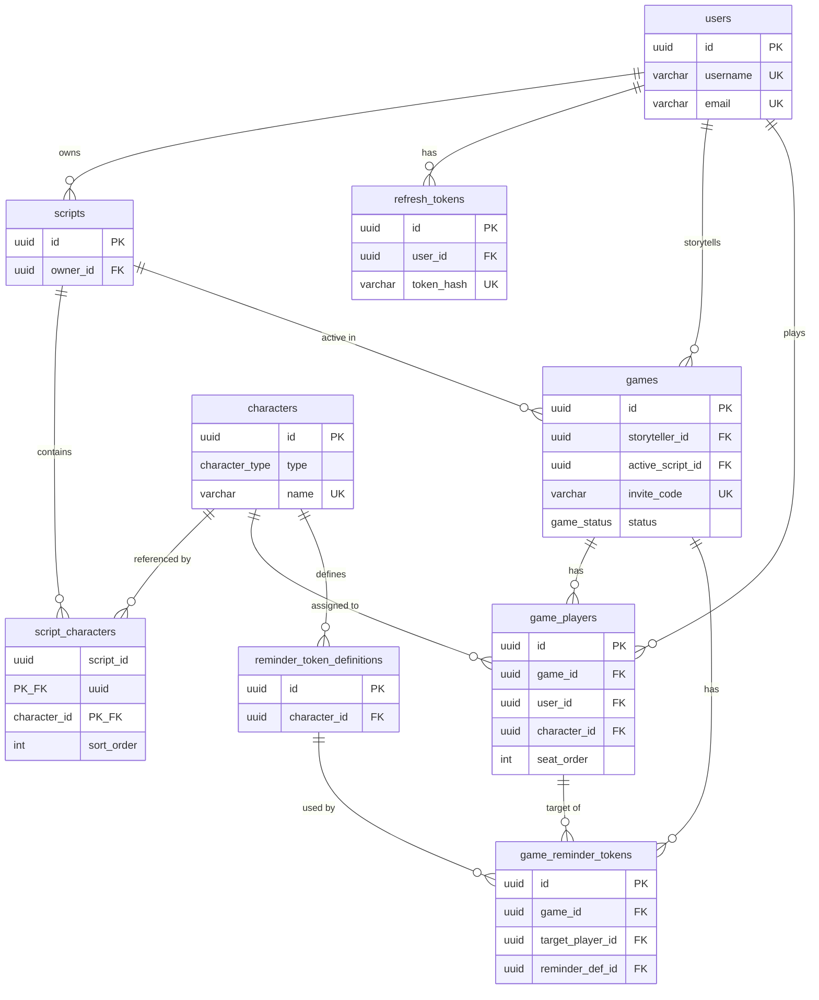

# Database schema

This document reflects the tables and types defined in **migrations only** (order: users → characters → scripts → `refresh_tokens` → `script_characters` sort order → games).

## Extensions

| Extension | Purpose |
|-----------|---------|
| `pgcrypto` | UUID generation via `gen_random_uuid()` for primary keys |

## Enum types

### `character_type`

PostgreSQL native enum used by `characters.type`.

| Value | Description |
|-------|-------------|
| `townsfolk` | — |
| `outsider` | — |
| `minion` | — |
| `demon` | — |
| `traveller` | — |

### `game_status`

PostgreSQL native enum used by `games.status`.

| Value | Description |
|-------|-------------|
| `lobby` | — |
| `in_progress` | — |
| `completed` | — |

---

## Tables

### `users`

Registered application users.

| Column | Type | Constraints | Notes |
|--------|------|-------------|-------|
| `id` | `UUID` | **PK**, default `gen_random_uuid()` | |
| `username` | `VARCHAR(30)` | **NOT NULL**, **UNIQUE** | |
| `email` | `VARCHAR(255)` | **NOT NULL**, **UNIQUE** | |
| `password_hash` | `VARCHAR(255)` | **NOT NULL** | |
| `display_name` | `VARCHAR(50)` | nullable | |
| `created_at` | `TIMESTAMPTZ` | **NOT NULL**, default now | Knex `timestamps` |
| `updated_at` | `TIMESTAMPTZ` | **NOT NULL**, default now | Knex `timestamps` |

---

### `characters`

Blood on the Clocktower–style character definitions (catalog rows).

| Column | Type | Constraints | Notes |
|--------|------|-------------|-------|
| `id` | `UUID` | **PK**, default `gen_random_uuid()` | |
| `name` | `VARCHAR(100)` | **NOT NULL**, **UNIQUE** | |
| `type` | `character_type` | **NOT NULL** | Native PG enum |
| `ability` | `TEXT` | **NOT NULL** | |
| `flavor_text` | `TEXT` | nullable | |
| `created_at` | `TIMESTAMPTZ` | **NOT NULL**, default now | |

---

### `scripts`

User-owned script documents (named lists of characters).

| Column | Type | Constraints | Notes |
|--------|------|-------------|-------|
| `id` | `UUID` | **PK**, default `gen_random_uuid()` | |
| `owner_id` | `UUID` | **NOT NULL**, **FK** → `users(id)` **ON DELETE CASCADE** | |
| `name` | `VARCHAR(100)` | **NOT NULL** | |
| `description` | `TEXT` | nullable | |
| `is_official` | `BOOLEAN` | **NOT NULL**, default `false` | |
| `created_at` | `TIMESTAMPTZ` | **NOT NULL**, default now | Knex `timestamps` |
| `updated_at` | `TIMESTAMPTZ` | **NOT NULL**, default now | Knex `timestamps` |

---

### `script_characters`

Many-to-many link between scripts and catalog characters (composite primary key). Ordering within a script is enforced per `sort_order`.

| Column | Type | Constraints | Notes |
|--------|------|-------------|-------|
| `script_id` | `UUID` | **NOT NULL**, **PK (composite)**, **FK** → `scripts(id)` **ON DELETE CASCADE** | |
| `character_id` | `UUID` | **NOT NULL**, **PK (composite)**, **FK** → `characters(id)` **ON DELETE CASCADE** | |
| `sort_order` | `INTEGER` | **NOT NULL**, **UNIQUE** with `script_id` (`script_id`, `sort_order`) | Backfilled from stable order, then constrained |

---

### `refresh_tokens`

Stored refresh-session rows for JWT refresh-token rotation and revocation (hash of the refresh JWT, not the raw token).

| Column | Type | Constraints | Notes |
|--------|------|-------------|-------|
| `id` | `UUID` | **PK**, default `gen_random_uuid()` | |
| `user_id` | `UUID` | **NOT NULL**, **FK** → `users(id)` **ON DELETE CASCADE** | |
| `token_hash` | `VARCHAR(255)` | **NOT NULL**, **UNIQUE** | Hash of refresh token for lookup |
| `expires_at` | `TIMESTAMPTZ` | **NOT NULL** | |
| `created_at` | `TIMESTAMPTZ` | **NOT NULL**, default now | |

---

### `games`

A hosted game session (lobby / in progress / completed).

| Column | Type | Constraints | Notes |
|--------|------|-------------|-------|
| `id` | `UUID` | **PK**, default `gen_random_uuid()` | |
| `storyteller_id` | `UUID` | **NOT NULL**, **FK** → `users(id)` | Default referential action (no `ON DELETE` in migration) |
| `active_script_id` | `UUID` | nullable, **FK** → `scripts(id)` | |
| `invite_code` | `VARCHAR(8)` | **NOT NULL**, **UNIQUE** | |
| `status` | `game_status` | **NOT NULL**, default `lobby` | Native PG enum |
| `name` | `VARCHAR(100)` | nullable | |
| `phase` | `VARCHAR(20)` | default `day` | |
| `day_number` | `INTEGER` | default `1` | |
| `created_at` | `TIMESTAMPTZ` | **NOT NULL**, default now | Knex `timestamps` |
| `updated_at` | `TIMESTAMPTZ` | **NOT NULL**, default now | Knex `timestamps` |

---

### `game_players`

Players seated in a game; links optional assigned catalog character.

| Column | Type | Constraints | Notes |
|--------|------|-------------|-------|
| `id` | `UUID` | **PK**, default `gen_random_uuid()` | |
| `game_id` | `UUID` | **NOT NULL**, **FK** → `games(id)` **ON DELETE CASCADE** | |
| `user_id` | `UUID` | **NOT NULL**, **FK** → `users(id)` | Default referential action |
| `character_id` | `UUID` | nullable, **FK** → `characters(id)` | |
| `seat_order` | `INTEGER` | nullable, **UNIQUE** with `game_id` (`game_id`, `seat_order`) | |
| `is_alive` | `BOOLEAN` | **NOT NULL**, default `true` | |
| `has_ghost_vote` | `BOOLEAN` | **NOT NULL**, default `true` | |
| `vote_used` | `BOOLEAN` | **NOT NULL**, default `false` | |
| `notes` | `TEXT` | nullable | |
| `created_at` | `TIMESTAMPTZ` | **NOT NULL**, default now | Knex `timestamps` |
| `updated_at` | `TIMESTAMPTZ` | **NOT NULL**, default now | Knex `timestamps` |
| — | — | **UNIQUE** (`game_id`, `user_id`) | One row per user per game |

---

### `reminder_token_definitions`

Catalog of reminder token labels tied to a character (definitions only; in-game tokens reference these optionally).

| Column | Type | Constraints | Notes |
|--------|------|-------------|-------|
| `id` | `UUID` | **PK**, default `gen_random_uuid()` | |
| `character_id` | `UUID` | **NOT NULL**, **FK** → `characters(id)` **ON DELETE CASCADE** | |
| `text` | `VARCHAR(100)` | **NOT NULL** | Display text for the definition |

---

### `game_reminder_tokens`

Reminder tokens placed on a player within a game; may reference a definition and/or use custom text.

| Column | Type | Constraints | Notes |
|--------|------|-------------|-------|
| `id` | `UUID` | **PK**, default `gen_random_uuid()` | |
| `game_id` | `UUID` | **NOT NULL**, **FK** → `games(id)` **ON DELETE CASCADE** | |
| `target_player_id` | `UUID` | **NOT NULL**, **FK** → `game_players(id)` **ON DELETE CASCADE** | |
| `reminder_def_id` | `UUID` | nullable, **FK** → `reminder_token_definitions(id)` | |
| `custom_text` | `VARCHAR(100)` | nullable | |
| `created_at` | `TIMESTAMPTZ` | **NOT NULL**, default now | |

---

## Relationships

- **`users` → `scripts`**: one user, many scripts (`scripts.owner_id`).
- **`users` → `refresh_tokens`**: one user, many refresh sessions (`refresh_tokens.user_id`); deleting a user removes their refresh rows (`ON DELETE CASCADE`).
- **`scripts` ↔ `characters`**: many-to-many via **`script_characters`**; deleting a script or character removes its junction rows (`ON DELETE CASCADE`). Within a script, **`sort_order`** is unique per `script_id`.
- **`users` → `games`**: storyteller (`games.storyteller_id`).
- **`scripts` → `games`**: optional active script (`games.active_script_id`).
- **`games` → `game_players`**: roster; deleting a game removes its players (`ON DELETE CASCADE`). **`(game_id, user_id)`** and **`(game_id, seat_order)`** are unique when `seat_order` is set.
- **`characters` → `reminder_token_definitions`**: catalog rows; deleting a character removes its definitions (`ON DELETE CASCADE`).
- **`games` / `game_players` → `game_reminder_tokens`**: in-game tokens; cascade from game or target player row.
