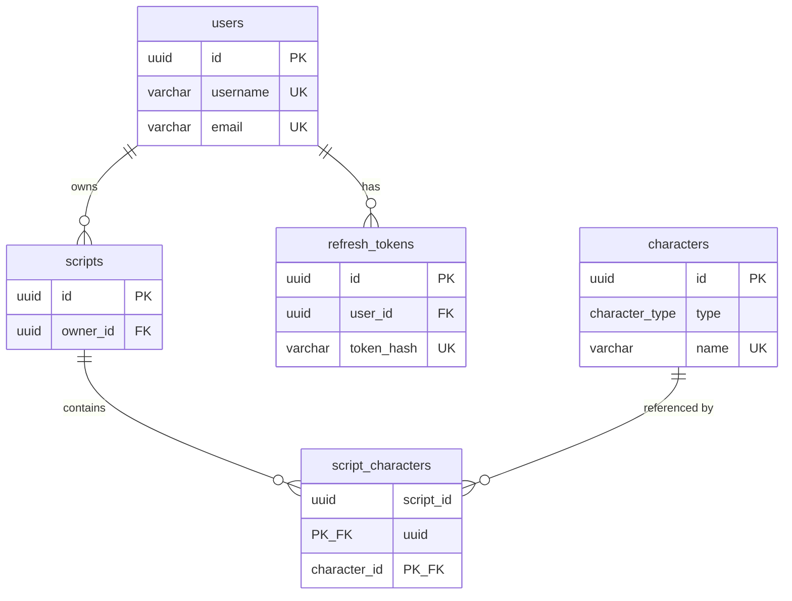

# Database schema

This document reflects the tables and types defined in **migrations only** (order: users → characters → scripts → `refresh_tokens`).

## Extensions

| Extension | Purpose |
|-----------|---------|
| `pgcrypto` | UUID generation via `gen_random_uuid()` for primary keys |

## Enum types

### `character_type`

PostgreSQL native enum used by `characters.type`.

| Value | Description |
|-------|-------------|
| `townsfolk` | — |
| `outsider` | — |
| `minion` | — |
| `demon` | — |
| `traveller` | — |

---

## Tables

### `users`

Registered application users.

| Column | Type | Constraints | Notes |
|--------|------|-------------|-------|
| `id` | `UUID` | **PK**, default `gen_random_uuid()` | |
| `username` | `VARCHAR(30)` | **NOT NULL**, **UNIQUE** | |
| `email` | `VARCHAR(255)` | **NOT NULL**, **UNIQUE** | |
| `password_hash` | `VARCHAR(255)` | **NOT NULL** | |
| `display_name` | `VARCHAR(50)` | nullable | |
| `created_at` | `TIMESTAMPTZ` | **NOT NULL**, default now | Knex `timestamps` |
| `updated_at` | `TIMESTAMPTZ` | **NOT NULL**, default now | Knex `timestamps` |

---

### `characters`

Blood on the Clocktower–style character definitions (catalog rows).

| Column | Type | Constraints | Notes |
|--------|------|-------------|-------|
| `id` | `UUID` | **PK**, default `gen_random_uuid()` | |
| `name` | `VARCHAR(100)` | **NOT NULL**, **UNIQUE** | |
| `type` | `character_type` | **NOT NULL** | Native PG enum |
| `ability` | `TEXT` | **NOT NULL** | |
| `flavor_text` | `TEXT` | nullable | |
| `created_at` | `TIMESTAMPTZ` | **NOT NULL**, default now | |

---

### `scripts`

User-owned script documents (named lists of characters).

| Column | Type | Constraints | Notes |
|--------|------|-------------|-------|
| `id` | `UUID` | **PK**, default `gen_random_uuid()` | |
| `owner_id` | `UUID` | **NOT NULL**, **FK** → `users(id)` **ON DELETE CASCADE** | |
| `name` | `VARCHAR(100)` | **NOT NULL** | |
| `description` | `TEXT` | nullable | |
| `is_official` | `BOOLEAN` | **NOT NULL**, default `false` | |
| `created_at` | `TIMESTAMPTZ` | **NOT NULL**, default now | Knex `timestamps` |
| `updated_at` | `TIMESTAMPTZ` | **NOT NULL**, default now | Knex `timestamps` |

---

### `script_characters`

Many-to-many link between scripts and catalog characters (composite primary key).

| Column | Type | Constraints | Notes |
|--------|------|-------------|-------|
| `script_id` | `UUID` | **NOT NULL**, **PK (composite)**, **FK** → `scripts(id)` **ON DELETE CASCADE** | |
| `character_id` | `UUID` | **NOT NULL**, **PK (composite)**, **FK** → `characters(id)` **ON DELETE CASCADE** | |

---

### `refresh_tokens`

Stored refresh-session rows for JWT refresh-token rotation and revocation (hash of the refresh JWT, not the raw token).

| Column | Type | Constraints | Notes |
|--------|------|-------------|-------|
| `id` | `UUID` | **PK**, default `gen_random_uuid()` | |
| `user_id` | `UUID` | **NOT NULL**, **FK** → `users(id)` **ON DELETE CASCADE** | |
| `token_hash` | `VARCHAR(255)` | **NOT NULL**, **UNIQUE** | Hash of refresh token for lookup |
| `expires_at` | `TIMESTAMPTZ` | **NOT NULL** | |
| `created_at` | `TIMESTAMPTZ` | **NOT NULL**, default now | |

---

## Relationships

- **`users` → `scripts`**: one user, many scripts (`scripts.owner_id`).
- **`users` → `refresh_tokens`**: one user, many refresh sessions (`refresh_tokens.user_id`); deleting a user removes their refresh rows (`ON DELETE CASCADE`).
- **`scripts` ↔ `characters`**: many-to-many via **`script_characters`**; deleting a script or character removes its junction rows (`ON DELETE CASCADE`).
